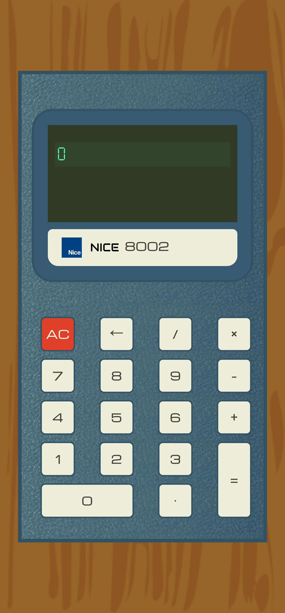

# Readme
# NICE Calculator

## Overview

A basic calculator app. It evaluates a single pair of operands at at time, but 
allows the user to operate on the result of the previous equation.  I decided to 
do all of the "extra-credit" assignments for this project, so it also handles 
floats, it has a backspace button and keyboard support, and I used CSS to craft a replica of an antique
Sharp calculator from the 1970s.    

P.S.: Try to find the "Easter Egg".  Hint: enter an equation that divides a number by *something*.....

### Challenge

The design requirements from The Odin Project to build a Calculator app are detailed
[here](https://www.theodinproject.com/paths/foundations/courses/foundations/lessons/calculator)

### Screenshot

  

### Links

- [Live site](https://mattdimicelli.github.io/No_Framework_Calculator/)
- [Repo](https://github.com/mattdimicelli/No_Framework_Calculator)

## My process

### Built with

- It's all Vanilla... no frameworks, no pre-built components
- Semantic HTML
- Google Font Service
- A mobile-first, responsive design
- Layout techniques such as CSS Grid and Flexbox
- The New CSS Reset
- @font-face

### What I learned

- For the JS, I decided to experiment with my own sort of "encapsulation technique", which I would not repeat again, but which I left as-is since it works, and I do not foresee any reason for this application to need to be refactored.  The "technique" entailed a somewhat-dense nesting of functions, as well as wrapping all of the code in an "IIFE module".  My intention was to get the variables out of the global scope, as well as adhere to the Principle of Least Exposure, by "exposing" variables (and function names) as little as possible, by nesting them where they are needed. I fear that these unorthodox design decisions might reduce the code's readability, but it was a good learning experience for me.  After seeing the "shape" of the code upon completion, I realize that I would prefer not to rely so heavily on nesting.  Nor do I think that the IIFE is truly necessary for an app like this; it was more of an exercise.

